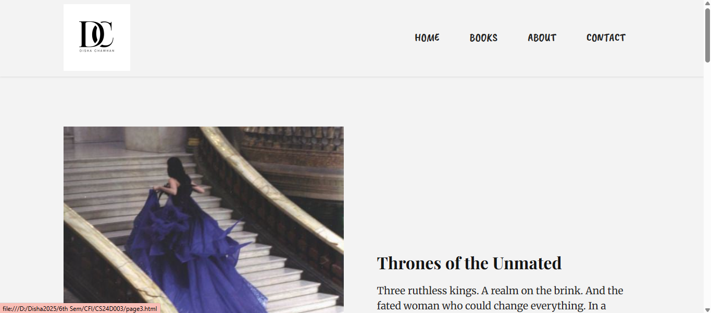

# Mobirise Website

A responsive website created using the Mobirise website builder.  
This project contains the complete source code of the website including HTML, CSS, JavaScript, and assets.

---

## Features

- Responsive design
- Built using Mobirise
- Modern UI layout
- Easy to customize
- Static website (HTML, CSS, JS)

---

## Technologies Used

- HTML5
- CSS3
- JavaScript
- Mobirise

---

## Installation

Clone the repository:

git clone https://github.com/your-username/your-repository-name.git

Open the project folder and run the website by opening **index.html** in your browser.

---

## Project Structure

---

## Screenshots

### Homepage

### About Section

---

## Deployment

The website can be hosted using **GitHub Pages** or any static hosting service.

---

## Author

Disha Chavan
